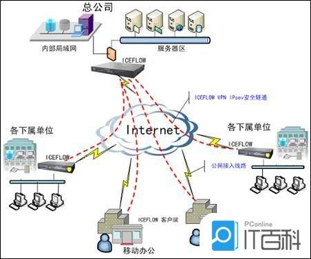

## 测验
#### 这是一个测验
* [百度][https://www.baidu.com/]
* [简介](README.md)
* 
* 

```java
public static void main(String[]args){} //Java
```

>这是一则引用
1. item 1
2. item 2
3. item 3

|  表头   | 表头  |
|  ----  | ----  |
| 单元格  | 单元格 |
| 单元格  | 单元格 |

**粗体1**

*斜体1*

~~删除线~~

这是水平线上的文本

---
